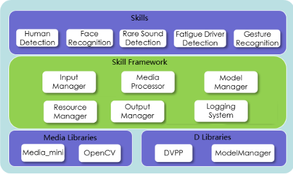

# Huawei HiLens Framework
Huawei HiLens Framework开发工具包（Huawei HiLens Framework SDK，Huawei HiLens Framework Software Development Kit）是HiLens Kit上运行的HiLens Framework的c++开发包，使用户可以开发c++版本的技能并在HiLens Kit上运行。

## Huawei HiLens Framework 简介

Huawei HiLens Framework通过封装底层接口、实现常用的管理功能，让开发者可以在Huawei HiLens管理控制台上方便地开发技能，培育AI生态。
Huawei HiLens Framework的分层结构如图:
<div align="center">

</div>
Huawei HiLens Framework封装了底层的多媒体处理库（摄像头/麦克风驱动模块Media_mini），以及D芯片相关的图像处理库（DVPP）和模型管理库（ModelManager），另外开发者也可以使用熟悉的视觉处理库OpenCV。在此之上，Huawei HiLens Framework提供了以下6个模块供开发者使用，方便开发诸如人形检测、人脸识别、疲劳驾驶检测等技能，模块说明如表所示:


| 序号 | 模块 | 功能 |
| --- | --- | --- |
| 1 | Input Manager | 负责视频、音频等输入数据的接入管理|
| 2 | Media Processor | 负责视频、音频等媒体数据的处理 |
| 3 | Model Manager | 负责模型的初始化与推断任务 |
| 4 | Output Manager | 负责流、文件、消息通知等输出任务的管理 |
| 5 | Resource Manager | 负责文件、图片、模型等资源的路径管理 |
| 6 | Logging System | 负责日志系统管理 |

## 环境准备

### 环境搭建

1.	查看您的编译机Linux系统环境。
执行uname -a可查看Linux系统信息,例如查看x86_64的ubuntu系统信息：
Linux ubuntu 4.4.0-144-generic #170-Ubuntu SMP Thu Mar 14 11:56:20 UTC 2019 x86_64 x86_64 x86_64 GNU/Linux
2.	查看端侧设备HiLens Kit的系统环境。
登录端侧设备的系统环境请参见使用SSH连接到HiLens Kit。
例执uname -a，可得如下HiLens Kit系统环境：
Linux Euler 4.19.36-vhulk1907.1.0.h448.eulerosv2r8.aarch #1 SMP Mon Jul 22 00.00.00 UTC 2019 aarch64 aarch64 aarch64 GNU/Linux
3.	下载交叉编译工具，并解压下载的压缩包。
如果您的编译机是x86_64的Linux系统，可以直接下载我们提供的交叉编译工具，里面已经包含了HiLens Kit上需要的库。
4.	进入交叉编译工具目录后，执行指令pwd获取路径位置，编译时设置编译器路径。
如果您的编译机是x86_64的Linux系统，路径位置是“.../aarch64-linux-gnu-gcc-7.3.0”，则编译时设置路径为：
export CC=".../aarch64-linux-gnu-gcc-7.3.0/bin/aarch64-linux-gnu-gcc"
export CXX=".../aarch64-linux-gnu-gcc-7.3.0/bin/aarch64-linux-gnu-g++"
详细的编译指导请参考步骤6中的示例代码。
5.	下载Huawei HiLens Framework SDK开发包：“cloud-c-sdk-HiLensFramework-1.0.4.tar.gz”，并解压，重命名文件名。
Huawei HiLens Framework SDK软件包下载地址为：https://hilens-framework-sdk-demo.obs.cn-north-1.myhuaweicloud.com/sdk/cloud-c-sdk-HiLensFramework-1.0.4.tar.gz
6.	参考示例程序和接口调用说明进行代码开发，编译指导和示例代码说明，详见示例代码中的“README.md”。
Huawei HiLens Framework示例代码下载地址为：https://hilens-framework-sdk-demo.obs.cn-north-1.myhuaweicloud.com/demo/license-plate-recognition-demo.zip

*Note* :  
    
    1. 搭建环境时，下载SDK开发包和参考示例程序进行代码开发必须在编译机上进行安装、调试。
    2. 开发过程中，您有任何问题可以在Huawei HiLens服务论坛中发帖求助

## 初始化 HiLens Framework 

该接口用于初始化HiLens Framework。在调用HiLens Framework的其他接口之前，需要先做全局初始化。

* 接口调用

```
HiLensEC hilens::Init(const std::string & verify)
```

* 参数说明

| 参数名 |  说明|
| --- | --- | 
|verify | 应与Huawei HiLens管理控制台上新建技能时，所填写的“基本信息”中的“检验值”一致。如果不一致，HiLens Framework会强制技能停止。|

* 返回值 

HiLensEC，错误码。0为成功，其他为失败。