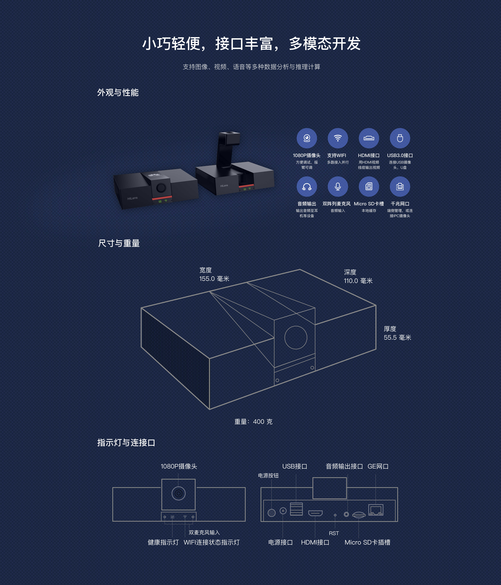
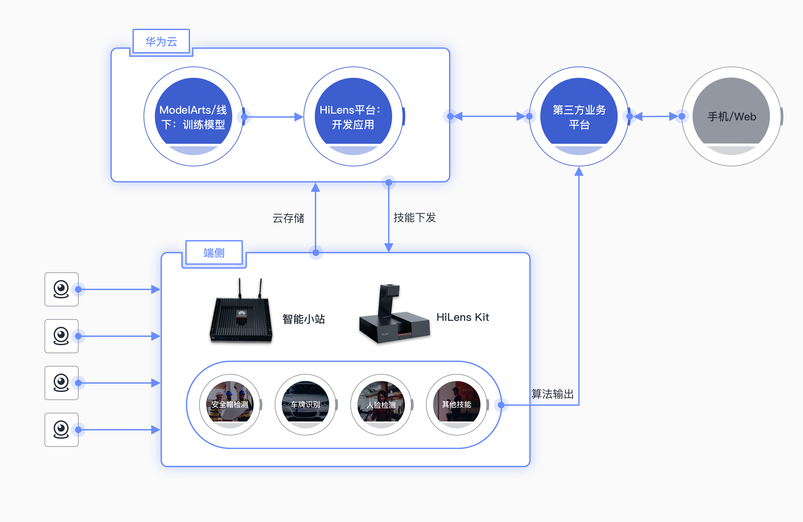

**`Documentation`** |
------------------- |
 |

[华为HiLens](https://www.huaweicloud.com/product/hilens.html)为端云协同多模态AI开发应用平台，面向AI应用开发者，软硬件厂商以及普通用户，提供简单易用的开发框架、开箱即用的开发环境、丰富的AI技能市场和云上管理平台，对接多种端侧计算设备，支持视觉及听觉AI应用开发、AI应用在线部署、海量设备管理等丰富功能。

华为HiLens由AI推理相机HiLens Kit以及智能小站等端侧设备和云上开发平台组成，可通过ModelArts或离线导入训练好的模型，同时平台也为Tensorflow,Caffe,Pytorch模型提供在线转换。HiLens Framework封装了视频分析算法的基础组件，如：图像处理，推理，日志，视频流推流上云，华为云上API对接。目前为开发者提供稳定的Python和C++ APIs.

华为HiLens Kit 多模态AI开发套件，端侧具有超强AI算力。华为自研昇腾AI加速模块（Ascend310),领跑业界的AI芯片，采用达芬奇架构，支持16TOPS算力，16路1080P 30fps视频分析；在视频编解码方面，支持H.265,H.264等多种规格的视频编解码，3559A的NNIE架构CPU与昇腾310融合架构，让开发和移植变得更加快速，支持工业级，行业级复杂AI算法的实时推理。

所有华为HiLens文档，请参考HiLens的[华为云文档主页](https://support.huaweicloud.com/hilens/index.html)，同时华为HiLens也开放了[开发者论坛](https://bbs.huaweicloud.com/forum/forum-771-1.html)供所有开发者讨论HiLens的开发和方向。你也许很有兴趣了解怎样快速将模型快速部署在端侧设备HiLens Kit上面，我们提供了贴心快速[入门手册](https://support.huaweicloud.com/qs-hilens/hilens_04_0002.html).欢迎大家，反馈问题和特性需求，上报bug在[GitHub Issue主页](https://github.com/huaweicloud/HiLens-Lab/issues).

**News: 华为HiLens创建了微信群，请添加华为云小助手，欢迎大家入群进行实时交流和分享！**

## 华为HiLens外观

## Framework 

华为HiLens云上开发平台包括一站式技能开发、设备部署与管理、数据管理、技能市场等，并提供统一的算法开发框架HiLens Framework屏蔽硬件细节，封装集成组件和开发调试环境环境HiLens Studio，帮助用户开发AI技能并将其推送到端侧计算设备，另外在技能市场内，预置使用于不同芯片的多种算法包，支持部署算法到HiLens Kit,智能小站以及第三方设备，覆盖商超，家庭，园区等多种商用场景，强大的HiLens 开发者社区，也可帮助企业根据场景定制AI算法。

## Resources

*   [华为HiLens主页](https://www.huaweicloud.com/product/hilens.html)
*   [华为HiLens论坛](https://bbs.huaweicloud.com/forum/forum-771-1.html)
*   [昇腾芯片模型转换](https://support.huawei.com/enterprise/zh/doc/EDOC1100107956)
*   [ModelArts](https://www.huaweicloud.com/product/modelarts.html)
*   [华为HiLens 快速入门](https://support.huaweicloud.com/qs-hilens/hilens_04_0002.html)
*   [华为HiLens帮助文档](https://support.huaweicloud.com/productdesc-hilens/hilens_01_0001.html)
*   [华为HiLens视频课程](https://education.huaweicloud.com:8443/courses/course-v1:HuaweiX+CBUCNXE034+Self-paced/about?isAuth=0&cfrom=hwc)
*   [HiLens Kit硬件参数](https://support.huawei.com/enterprise/zh/ai-computing-platform/a200-3000hilens-pid-250700826)
*   [华为HiLens FAQ](https://support.huaweicloud.com/hilens_faq/HiLens_03_0001.html)

## License 

[Apache License 2.0](LICENSE)