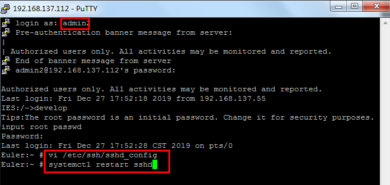
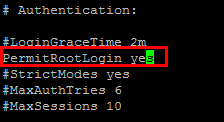
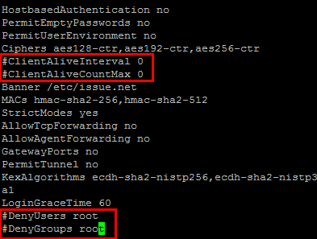
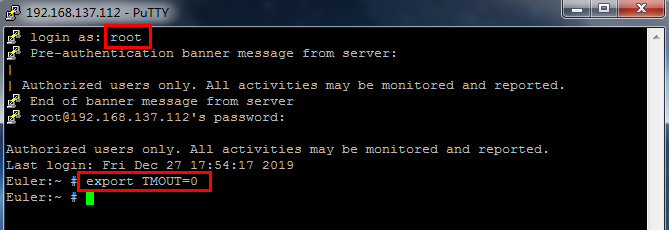
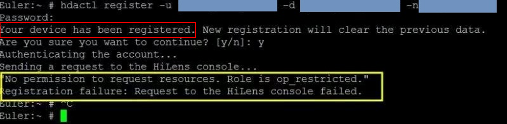

# 咨询类

##  1 HiLens Kit与Atlas 200 DK的区别

Atlas 200 DK偏底层开发和纯离线开发，需要开发者理解和遵从[HiAi Engine流程编排]( https://ascend.huawei.com/doc/Atlas200DK/1.3.0.0/zh/zh-cn_topic_0178961795.html)和思考接口实现要求，代码复杂度高一些。HiLens Kit搭配开发框架HiLens Framework，偏应用开发，接口封装性高，接口简单，开发者直接使用，代码简单，且提供更多的外设接口。HiLens Kit作为HiLens的一部分，能和云侧HiLens 平台无缝集成。

## 2 HiLens Kit是否支持在离线情况下运行技能？

HiLens不支持完全离线的场景，技能启动后会进行license校验，校验成功后直到license到期前是可以离线运行的。

## 3 HiLens和ModelArts的关系

ModelArts核心功能是模型训练。HiLens 偏AI应用开发，并实现端云协同推理和管理。ModelArts训练出模型，在ModelArts或者HiLens中转换后，在HiLens [导入模型]( https://support.huaweicloud.com/usermanual-hilens/hilens_02_0062.html)并[新建技能]( https://support.huaweicloud.com/usermanual-hilens/hilens_02_0062.html)，在其中[编写自己的逻辑代码]( https://support.huaweicloud.com/usermanual-hilens/hilens_02_0029.html)等，就可以完成AI技能开发，最后将技能部署到HiLens Kit上运行。

## 4 有没有HiLens Kit的详细硬件介绍？

HiLens Kit的所有硬件相关资料请参见：https://support.huawei.com/enterprise/zh/doc/EDOC1100112066/be03db04

## 5 HiLens Kit与Atlas 500智能小站的区别？

HiLens Kit适合用于室内场景，Atlas500智能小站为工业化设计，耐高温、低温、防水防尘，室外使用更可靠。

## 6 HiLens Studio 什么时候发布？

预计3月份。

## 7 HiLens Kit可以进行本地开发吗？

在Console将技能部署到HiLens Kit后，SSH进入 /home/hilens/hda/skill 目录下指定技能文件夹，修改代码，然后用 ``` $ hdactl start -s $skill_id ``` 命令拉起，便可以去日志里面查看调试信息。若要停止技能，使用 ``` $ hdactl stop -s $skill_id ``` 。其中技能的 skill_id 可以在技能的文件夹名字中看到（名字的最后一段）。

## 8 HiLens可以帮忙定制技能吗？

可以。请联系华为一线人员（华为云业务部 李伟略 13810967224）。

## 9 HiLens平台提供AI算法开发教程吗？

提供，有帮助文档、视频教程、论坛教程、微信交流群等可以交流，教程会持续更新。
开发技能文档：https://support.huaweicloud.com/usermanual-hilens/hilens_02_0019.html；
视频教程：https://education.huaweicloud.com:8443/courses/course-v1:HuaweiX+CBUCNXE034+Self-paced/about?isAuth=0&cfrom=hwc；
论坛：https://bbs.huaweicloud.com/forum/forum-771-1.html

## 10 HiLens技能如何收费吗？免费技能可以直接商用吗？

商用技能为X元/技能/路/年，已技能市场上显示的价格为准 。技能市场上的免费技能仅供开发验证用途，不支持商业精度保障，不建议直接用于商业用途。

## 11 如何购买智能小站？

智能小站尚未在华为云上正式出售，如有合作项目测试需求，请联系华为一线人员（华为云业务部 李伟略 13810967224）。

# 操作类

## 1 如何用root登录，并关闭连接超时？

超时控制有3个位置：sshd超时、clp超时(15min)、shell超时(5min)。clp超时目前还无法关闭，无论是否有操作，15分钟后断线。

1. 关闭sshd超时：
以账号名登录（默认admin），切换到develop模式。

```vi /etc/ssh/sshd_config```，找到以下设备并对应修改

```
PermitRootLogin yes（默认为PermitRootLogin no）
（以下语句默认开头无注释，修改为在前面增加注释符号，去掉限制root登陆的设置）
#ClientAliveInterval 0
#ClientAliveCountMax 0
#DenyUsers root
#DenyGroups root

```
<div align="left">

</div>

<div align="left">

</div>

<div align="left">

</div>

2. 用root登录。关闭shell超时：命令行输入export TMOUT=0

 <div align="left">

</div>

## 2 如何管理设备文件？

删除sftp限制，命令行输入：
``` rm -rf /etc/usr/sftp_disable ```
再重新开一个SSH窗口，便能把本地文件放入/tmp中，也能在/tmp中把文件夹拉取到本地。
注意：
1. /tmp为临时文件夹，设备重启后清除。若需保留，则需将文件再移动到其他文件夹。
2. /tmp里如果有同名文件，则外面的文件无法放进，不会自动覆盖。
3. /tmp里的文件若需拷贝出来，需要修改可读权限(chmod a+r /tmp/filename) 

## 3 WiFi连接不上

当前HiLens Kit仅支持2.4G频段的无线网络和常规的加密类型无线网络。
1. 支持的2.4G频段无线网络所使用的协议为IEEE802.11n\IEEE802.11g\IEEE802.11b。
2. 支持的无线网络加密类型有WEP、WPA-PSK/WPA2-PSK和AES。
3. 暂不支持需要验证的无线网络。
4. 暂不支持TKIP加密。

## 4 HDMI输出黑屏或者卡住？

启动了多个HDMI输出的技能会导致黑屏或者卡屏。如果技能是HDMI输出的，则只能运行一路技能，因为HDMI仅能输出一路视频。若是接入多路视频，则可以在代码中指定，如只输出第一路的视频。
切换HDMI输出的技能时，先停止运行中的技能，再启动另一个技能。
5安装技能不成功？

1. 检查设备是否是离线状态。若离线，请重启HiLens Kit，让HiLens Kit处于在线状态。
2. 检查网络是否连通。命令行输入ping 8.8.8.8和ping www.huaweicloud.com是否能ping通。
3. 检查时间是否同步。SSH窗口命令行输入date，看时间是否同步，不同步则请修改：

调整时区，与中国时区一致，执行命令
```
timedatectl set-timezone Asia/Shanghai
```
修改设备时间，以当前时间为2019年10月17日19时19分19秒为例。执行命令
```
date -s “2019-10-17 19:19:19”（注意使用英文引号)
hwclock –w
reboot
```

## 6 设备注册失败，显示“Role is op_restricted.”

使用的华为云账号是受限账号，请查看该账号是否欠费，或确认IAM是否受限。

 <div align="left">

</div>

## 7 设备固件升级是否一定要按顺序升级，能否直接升到最新版本？为什么设备在线，但是固件升级还是提示失败？

固件升级不需要按顺序，可以直接升级到最新版本。如果设备在线，但是固件升级和技能安装一直失败，可以参考上面第7条调整时区信息：
SSH窗口命令行输入date，看时间是否同步，不同步则请修改：
调整时区，与中国时区一致，执行命令
```
timedatectl set-timezone Asia/Shanghai
```
修改设备时间，以当前时间为2019年10月17日19时19分19秒为例。执行命令

```
date -s “2019-10-17 19:19:19”(注意使用英文引号)
hwclock –w
reboot
```
## 8 同一台HiLens Kit是否可以被多个华为云用户注册？

不可以，一台设备只能注册到一个账号下，更换账号需要先在HiLens官网上注销原用户才能再次注册。
## 9  HiLens Kit是否支持接入多路USB摄像头？如果从HiLens的USB口接入一个USB HUB，在/dev下能识别0至n-1个摄像头吗？

Hilens Kit有两个USB口，可以接入两路摄像头，但受带宽限制只能从其中一路摄像头拉视频流（因此没必要接多路），插入摄像头后会在/dev目录下生成2个设备节点video0和video1，具有视频捕获功能的一般是第一个video0，因此软件里面devId传参通常是用0。

## 10注册命令后一直提示“Password: Authenticating the account”，无法注册。

注册时输入了5次错误的华为云账号，导致账户被锁。锁定15min后自动解锁。

## 11 HiLens Kit使用的EulerOS版本？缺少yum包管理，如何安装？

HiLens Kit安装的EulerOS，是经过裁剪的，所以默认没有安装yum，所使用的EulerOS版本为EulerOS release 2.0 (SP8)，后期会更新帮助文档说明裁剪步骤及对应EulerOS系统详细版本；建议您可以参考华为HiLens帮助文档，快速注册和使用HiLens Kit，文档链接：https://support.huaweicloud.com/usermanual-hilens/hilens_02_0048.html
yum安装可以参考论坛安装yum：https://bbs.huaweicloud.com/forum/thread-36021-1-1.html

## 12 如何恢复出厂设置？

按照操作指导恢复出厂设置：https://support.huawei.com/enterprise/zh/doc/EDOC1100112066/9b0a1fba

## 13 HiLens Kit能同时运行多少个技能？

目前平台限制最多同时运行5个技能。

## 14 HiLens Kit如何外接摄像头？

请参考HiLens管理控制台 - 技能开发 - 技能模板中的安全帽检测技能模板，其中展示了如何外接多路摄像头，参见 https://console.huaweicloud.com/hilens/?region=cn-north-4#/hilens/projectTemplate/templateDetail/%E5%AE%89%E5%85%A8%E5%B8%BD%E6%A3%80%E6%B5%8B%E6%A8%A1%E6%9D%BF/ff8080826ef01083016efd5c5b280047/false

## 15 HiLens Kit支持USB外接鼠标吗？

暂不支持。

## 16 自带摄像头的焦距是多少？可以调整吗？

HiLens Kit自带摄像头为固定焦距2.8mm，监控角度为广角120度，监控距离0~4米。焦距不可调整。

# 算法类

## 1 在HiLens Kit上用模型推理时，明明输入的图片尺寸与模型输入是一致的，但是仍然报错说模型的inputTensorVec size与我的input size不一致？而且刚好相差一倍。

请检测您的模型来源，是否有说明模型的输入数据格式是YUV420SP_U8，而您输入的图片格式是RGB（或BGR）格式。同一张图片，RGB格式与YUV格式大小相差一倍。如果需要将RGB图片转为YUV，可以使用hilens.cvt_color接口，具体调用方法参见https://support.huaweicloud.com/devg-hilens/hilens_05_0017.html。

## 2 如何在HiLens Kit安装软件包？

HiLens Kit 目前支持以下三种方式安装：python3 -m pip install，源码编译安装，rpm包安装。
pip：目前可以装上一些库，比如requests，也可以使用其他pip源
python3 -m pip install requests -i http://pypi.douban.com/simple --trusted-host pypi.douban.com
源码编译安装：源码编译aarch64版本的软件包
rpm安装：华为云开源镜像站上下载相应的rpm包及其依赖并使用rpm安装
也可以参考论坛安装yum：https://bbs.huaweicloud.com/forum/thread-36021-1-1.html
安装yum之后可以用yum安装相应的包

## 3 模型推理时，输出不是list，始终是一个int型的数17，这是什么原因？

输入的数据尺寸与模型要求的输入尺寸不一致，此时model.infer接口返回的是错误码，即int型的数字17。请检查您的模型输入要求。

## 4 HiLens上可以运行哪些TensorFlow和caffe的模型？

确切的说，HiLens上只能运行om模型，HiLens控制台的模型转换页面支持将某些TensorFlow/Caffe模型转成om模型，当前可支持的算子范围可参考如下链接，更多的算子支持还在开发中：
https://support.huaweicloud.com/usermanual-hilens/hilens_02_0059.html
https://support.huaweicloud.com/usermanual-hilens/hilens_02_0060.html

## 5 一个技能是否可以使用多个模型，如何添加？

可以，在创建技能的时候添加模型是可以多选的；也可以将多个模型与代码打包在一起，用相对路径去访问。

## 6 是否可以将HiLens Kit摄像头拍摄的画面或者技能运行结果录成视频保存下来？

可以，请使用OpenCV的VideoWriter，注意录制的视频格式必须是MJPG，参考代码如下：

```
    camera  = hilens.VideoCapture()
    
    fps    = 20
    size   = (1280, 720)
    format = cv2.VideoWriter_fourcc('M','J','P','G')
    writer  = cv2.VideoWriter("output.avi", format, fps, size)
    
    count      = 0
    duration = 100 # 录制的视频时长
    while True:
        input_nv21 = camera.read()
        
        input_bgr = cv2.cvtColor(input_nv21, cv2.COLOR_YUV2BGR_NV21)
        writer.write(input_bgr)
        
        if count >= fps * duration:
            break
        count += 1
    writer.release()
```

## 7 技能启动后，异常停止。

请在端侧查看技能日志。如报错如下，则请确认技能检验值与代码是否一致，请将两者改成一致

<div align="left">

</div>

## 8 技能开发中可以使用socket吗？

技能可以编写socket程序，不需要特殊参数设置，请检查是否有防火墙

## 9 如何转换模型？日志如何查看？

请参见：https://support.huaweicloud.com/usermanual-hilens/hilens_02_0062.html

## 10 模型转换时（pb转成om格式），如何确定输入张量形状？

pb转om时的张量形状就是pb模型的输入节点和shape

## 11 HiLens支持的模型必须是ModelArts 训练出的模型吗？

不一定要用Modelarts，也可以本地训练。具体的要求和操作可参考：https://support.huaweicloud.com/usermanual-hilens/hilens_02_0062.html

## 12 支持自行开发算子吗？

可以根据海思相应的技术文档自行开发算子，但是过程较为复杂，HiLens不提供开发算子相关的技术支撑，建议开发者使用已支持的算子进行技能开发

## 13 提供的开发环境是什么语言？

支持使用Python 3.7和C++进行技能开发

## 14 HiLens Kit可以导入自定义的Python模块吗？

可以。和普通的Python环境一样。如果想要使用Python的其他包，可以使用源码编译的方式安装

# 购买及退换

## 1 可以同时使用多张优惠券吗？

每个订单只能使用一张优惠券，如购买两台，则请下两个订单。2019/12/11—2020/2/20活动期间有满4199减600（购买1台使用）满20995减3000元（购买5台使用），请在页面按需领取后再下单。
https://activity.huaweicloud.com/HiLens-promotion.html

## 2 支持退货吗？

7天出现非人为的质量问题或故障，经客服确认后可退货，我司承担来回运费，支持顺丰到付。
所有售后机器在寄回时，请附上我司出库单并在空白处备注售后原因（如出库单遗失，备注售后原因外，还请说明下单平台、订单编号、客户电话和地址等必要信息）。如未按以上要求寄回，造成售后延误，我司不承担相关责任；
不支持无理由退货。
售后策略已在购买页说明：https://console.huaweicloud.com/hilens/?region=cn-north-1#/hilens/skillMarket/hilensKitPurchase

