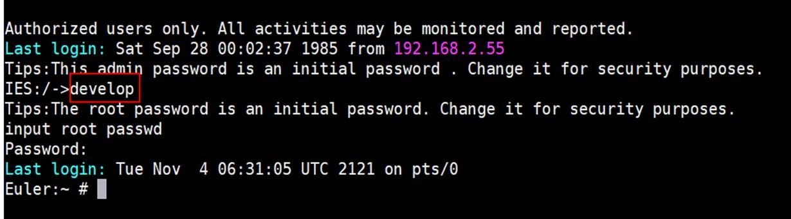

# 一键部署AI模型到端侧设备Hilens Kit

## 介绍


### 什么是HiLens 
华为HiLens由具备AI推理能力的HiLens Kit和云上开发平台组成，包括一站式技能开发、设备部署与管理、数据管理、技能市场等，帮助用户开发AI技能并将其推送到端侧计算设备。

### 产品优势
- **端云协同推理**
 1. 端云模型协同，解决网络不稳的场景，节省用户带宽。
 2. 端侧设备可协同云侧在线更新模型，快速提升端侧精度。
 3. 端侧对采集的数据进行本地分析，大大减少上云数据流量，节约存储成本。

- **统一技能开发平台**

    端云协同优化，简洁易用的HiLens Framework，封装基础组件，简化开发者的skill开发工作。
- **跨平台设计**
 1. 支持Ascend芯片以及其他市场主流芯片，可覆盖园区，家庭，商超等主流应用场景。
 2. 针对端侧芯片自动适配和算法优化。

- **丰富的技能市场**
 1. 技能市场预置了多种技能，如人形检测、哭声检测等，用户可以省去开发步骤，直接从技能市场选取所需技能，在端侧上快速部署。
 2. 技能市场的多种模型，针对端侧设备内存小、精度低等不足做了大量算法优化。
 3. 开发者还可通过HiLens管理控制台开发自定义技能并加入技能市场。

## 案例内容
此Codelab将以HiLens技能市场中的人脸特殊为例，带领开发者体验体验注册HiLens Kit，技能订购，查看技能运行效果的全过程。技能安装成功后，摄像头将根据不同的性别给你的脸加上不同的特效。可以通过HDMI连接屏幕查看。 流程如下图所示：  

## 案例目标

- 掌握注册HiLens Kit
- 掌握使用HiLens技能订购功能，查看技能效果


## 您需要什么？

- 一台电脑（Windows）

- 一条网线 和一条HDMI线

- 谷歌浏览器

- 一台HiLens Kit（如需购买，请在[此处](https://console.huaweicloud.com/hilens/?region=cn-north-4&locale=zh-cn#/hilens/skillMarket/hilensKitPurchase)购买）

## 准备工作

体验一键部署AI模型到端侧设备，需要完成以下准备工作。

### 创建华为云账号  Duration：2min  

参考[此链接](https://support.huaweicloud.com/prepare-modelarts/modelarts_08_0001.html)，注册华为云账号。

 **注意:** 请及时检查账号状态，避免账号处于欠费或冻结状态时资源被冻结，影响您的使用。 

### 完成HiLens基本操作   Duration：20min  
1.	将HiLens Kit连接到电脑  
  
  
（1）	将DC 12V的电源适配器的端口插入HiLens Kit后面板的电源接口  
（2）	打开HiLens Kit的电源开关（按住开关键1到2秒放开）  
（3）	将网线的一端连接到设备的以太网口上，另一端连接到对端设备的以太网口上。  
正常开机后，如下图显示灯会亮。  
 
2. 设置本地IP  
将电脑本地IP修改为和HiLens Kit同一网段，使得本地能SSH登录到HiLens Kit。  
（1）	打开“控制面板”—>“网络和Internet”—>“网络和共享中心”—>“更改适配器设置”  

（2）	鼠标右键“设备连接”，单击“属性”。以“本地连接”为例，右键单击“属性”后，进入本地连接属性。 
 设备连接：指HiLens Kit用网线连到电脑后，在电脑的网络连接页面上显示的连接。一般是“本地连接”，如果电脑已有本地连接，设备连接标题可能是“本地连接2”，连接信息一般是“未识别的网络”。  
（3）	点击“属性”—>“网络”，双击“Internet协议版本4（TCP/IPv4）”，设置IP，保证和HiLens Kit的默认IP在一个网段。HiLens kit 默认IP为 ``192.168.2.111``，本地IP一般选择192.168.2.1~255（111除外），如下：  
  
（4）	查看HiLens Kit 与电脑是否能够成功通信，需Ping HiLens Kit 的IP: ``192.168.2.111``。**“如成功ping通HiLens Kit，则进行下一步”**。
 
3. SSH远程连接端侧设备
打开SSH工具登录到Kit，IP为 ``192.168.2.111``，用户名：``admin``，密码：``Huawei12#$``，然后进入开发者模式，输入``develop``，密码：``Huawei@SYS3``。  
（1）下载安装[mobaXterm](https://mobaxterm.mobatek.net/download.html)  
（2）运行mobaXterm，选择Session，如下图：  
  
（3）在“IES：/->”提示语后执行命令 ``develop``:  
  
4. 设置时间  
命令行输入 ``date``，检测HiLens Kit时间与网络时间是否匹配，若不匹配，需要重新设置时间：
```    
    #设置时区为中国时区
    timedatectl set-timezone Asia/Shanghai
    #修改-s后的时间为你当前的时间
    date -s "2019-5-27 16:25:30"
    hwclock -w
    # 查看是否已经同步
    hwclock -r
```
5. 网络连接  
本案例详细介绍HiLens Kit通过WIFI连接网络，其他方式请参考[此文档](https://support.huaweicloud.com/usermanual-hilens/hilens_02_0050.html):  
（1）登录Huawei HiLens智能边缘管理系统
浏览器输入``https://192.168.2.111``，登录Huawei HiLens智能边缘管理系统。用户名为``admin``，密码为``Huawei12#$``  
  
（2）配置WIFI
单击“网络”，在“网络”页签下，单击“无线网络”，进入“无线网络”配置。选择对应的路由器，单击“连接”，弹出“WIFI连接”对话框，输入正确密码。单击“确定”，完成连接。  
  
（3）检测网络  
SSH连接到HiLens Kit，参考本节步骤3：SSH远程连接端侧设备 ，```ping 8.8.8.8``` 或者 ```ping www.baidu.com```，若出现以下信息，说明网络连接成功。  
  
6. 注册设备  
（1）同意授权  
登录Huawei HiLens[管理控制台](https://console.huaweicloud.com/hilens/)，注意，这里region选择“北京四”。如果没有授权HiLens服务，会出现授权弹窗。阅读《华为HiLens服务条款》后，勾选条款，点击 **“同意授权”**
  
（2）登陆HiLens Kit终端

 在检测网络是连接成功状态后，执行以下命令完成设备注册。
```
  hdactl register -u用户名 –d账号名 –n设备名
```
  其中，如果没有IAM账号，则“用户名”和“账号名”一致，都为华为云账号名。如果有IAM账号，则有相应“用户名”和“账号名”。设备名需用户自定义。按回车完成设备注册。
  
  输入注册指令之后，会提示输入密码，此时输入华为云账号密码：


（3）注册到HiLens console

  登录Huawei HiLens[管理控制台](https://console.huaweicloud.com/hilens/)，单击左侧导航栏“设备管理>设备列表”，可查看设备状态。注意，这里region选择“北京四”。

  
（4）升级固件

 注册完成后，检查固件是否为最新版本。固件版本``1.0.0``为出厂版本，需升级到最新版本，点击 **“设备管理—>设备列表”**，找到你已经注册的设备，点击 **“固件列表”**中，选择最新固件进行升级，如图所示：
   
此时你已经将HiLens Kit与自己的华为云账号关联，请继续完成此次codelab之旅。 


## 购买技能   Duration：3min  
登录[HiLens管理控制台](https://console.huaweicloud.com/hilens/)。单击左侧导航栏 **“技能市场”** > **“技能市场”**，进入“技能市场”页面。在搜索框搜索“人脸检测”，单击技能进入技能详情页面。
  
单击“立即购买”，进入“购买技能”页面。  
  
输入购买参数，可直接使用默认值。
 
若需修改,参见下图：

确认费用后，单击“立即购买”。购买成功后，“人脸特效”将存储至“技能市场 > 我的技能”页面中。

## 安装技能  Duration：5min  
1. 在[HiLens管理控制台](https://console.huaweicloud.com/hilens/)中，单击左侧导航栏 **“技能市场”**> **“我的技能”**，进入“我的技能”页面，默认打开“我的订单”。
“我的订单”页面展示了您已购买的所有技能列表。
2. 选择技能名称为“人脸特效_HDMI”的订单，单击 **“安装”** 。  
3. 在安装技能弹出的对话框中，勾选你已注册的设备名称，确认后单击 **“安装”**。    
安装过程中，HiLens管理控制台会将技能包下发到设备。下发技能包需要一段时间，可以从进度条中看到技能安装进度，下发完成后“进度”栏会提示“安装成功”。  

4. 点击 **“确定”** 完成技能部署
5. 执行如下操作确认技能是否正常安装。若技能状态为“安装成功”，说明技能正常安装至设备。  
a.单击左侧导航栏“设备管理 >设备列表”，进入设备列表页面。  
b.单击已注册设备的“技能管理”，检查技能状态是否为“安装成功”，如图所示，技能成功下发到设备。  
  
### 启动技能
登录[Huawei HiLens管理控制台](https://console.huaweicloud.com/hilens/)进入"**设备管理**">"**技能管理**"。


进入技能管理界面，可以看到自己所有技能。将HDMI线连接HiLens Kit和显示屏，点击右侧“**启动**”。


完成启动后，就可以开始使用此技能。请站在摄像头视野中央，Hilens Kit将根据性别实现特效。
### 停止技能
为避免技能收费，请及时停止技能。单击左侧导航栏 **“设备管理”** > **“技能管理”**，进入“技能管理”页面。点击技能后面对应的 **“停止”**


## 注销设备 Duration：5min
使用完后为方便其他账号使用，请注销设备。若不将此设备注销，其他用户将无法注册此设备。若此HiLens为您的个人设备，则无需进行此步骤。
### 卸载技能
设备注销时，需先卸载技能。登录[Huawei HiLens管理控制台](https://console.huaweicloud.com/hilens/),依次选择 **“设备管理”**> **“技能管理”**> **“卸载”**。依次卸载所有技能。


### 注销设备
依次选择 **“设备管理”**> **“注销设备”**，完成设备注销。


## 恭喜你

- 祝贺您，您已经使用华为云完成了一键部署AI模型到端侧设备HiLens Kit！


### 接下来您可以


### 参考文献

-  https://support.huaweicloud.com/usermanual-hilens/hilens_02_0001.html

-  https://support.huaweicloud.com/usermanual-hilens/hilens_02_0036.html


