# HiLens Kit 安装ROS 教程 

由于大部分的ROS是基于python2环境，但是kit自带的python环境是python3，因此，本教程将从python2的安装开始，逐步介绍ROS系统的整个安装过程。

## 预置文件 

1.  [hilens_ros.tar.gz](https://tutorials.obs.cn-north-1.myhuaweicloud.com/ros/hilens_ros.tar.gz)
2.  [python_req2.zip](https://tutorials.obs.cn-north-1.myhuaweicloud.com/ros/python_req2.zip)
3.  [python2.7.2.zip](https://tutorials.obs.cn-north-1.myhuaweicloud.com/ros/python2.7.2.zip) 

将上述下载的文件上传至/tmp目录下,执行如下指令。

```
$ cd /var/lib/docker/zsc  #建议在/var/lib/docker/路径下操作，保证磁盘空间足够，zsc为我创建的文件夹
$ mkdir ros
$ cd ros/
$ mkdir data #下载的文件放在此目录
$ mkdir env  #  ros环境目录
$ cd data
$ cp /tmp/hilens_ros.tar.gz .
$ cp /tmp/python2.7.2.zip .
$ cp /tmp/python_req2.zip .
``` 
<div align="left">
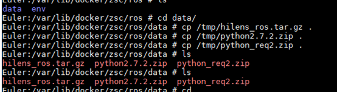
</div>

## Python 安装 

直接使用本文提供的python包，解压，并设置相关环境变量。如果你想自行编译Python库，可以参考https://blog.csdn.net/xiwenfuor/article/details/38384687，需要修改交叉编译工具链为aarch64-linux

```
# 进入env目录
$ unzip ../data/python2.7.2.zip
$ mv _install/ python2 # 换个名字
```

<div align="left">
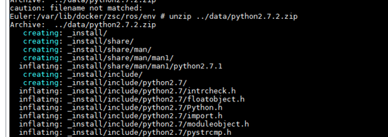
</div>

<div align="left">

</div>

环境变量设置: 

```
$ PYTHON_HOME=/var/lib/docker/zsc/ros/env/python2
$ export PATH=$PATH:$PYTHON_HOME/bin
$ export PYTHONPATH=$PYTHONPATH:$PYTHON_HOME/lib/python2.7
$ export LD_LIBRARY_PATH=$LD_LIBRARY_PATH:$PYTHON_HOME/lib
```
<div align="left">

</div>
执行python命令，若能够进入python环境，则python安装正常.

## ROS安装

**更新python库，安装vim、pip、numpy库**

首先安装rpm包依赖，关于rpm包的依赖我已经下载好放在python_req文件件中，安装完之后可以执行python2，此python环境是ros实际运行的环境。之前的python环境可作废。

```
$ cd /var/lib/docker/zsc/ros/env/
$ tar zxvf ../data/hilens_ros.tar.gz
```
<div align="left">
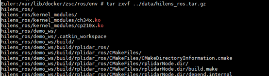
</div>

进入python_req文件夹，将下载的python_req2.zip解压至python_req文件夹中，执行以下安装命令：

```
$ cd ./hilens_ros/python_req
$ unzip ../../../data/python_req2.zip
```

```
$ rpm -i python2-2.7.17-1.fc29.aarch64.rpm
$ rpm -i --nodeps python2-libs-2.7.17-1.fc29.aarch64.rpm
$ rpm -i python2-2.7.17-1.fc29.aarch64.rpm
$ rpm -i python2-setuptools-40.8.0-1.fc29.noarch.rpm
$ rpm -U python2-pip-18.1-1.fc29.noarch.rpm
$ rpm -U python2-netifaces-0.10.6-5.fc29.aarch64.rpm
$ rpm -U python2-nose-1.3.7-21.fc29.noarch.rpm
$ rpm -U libgfortran-8.2.1-2.fc29.aarch64.rpm
$ rpm -U openblas-0.3.7-1.fc29.aarch64.rpm
$ rpm -U openblas-serial-0.3.7-1.fc29.aarch64.rpm
$ rpm -U openblas-threads-0.3.7-1.fc29.aarch64.rpm
$ rpm -U python2-numpy-1.15.1-1.fc29.aarch64.rpm
$ rpm -U tmux-2.9a-2.fc29.aarch64.rpm
$ rpm -i gpm-libs-1.20.7-16.fc29.aarch64.rpm
$ rpm -i vim-filesystem-8.1.2198-1.fc29.noarch.rpm
$ rpm -i vim-common-8.1.2198-1.fc29.aarch64.rpm
$ rpm -U vim-enhanced-8.1.2198-1.fc29.aarch64.rpm
$ rpm -U --reinstall python2-numpy-1.15.1-1.fc29.aarch64.rpm

```

<div align="left">
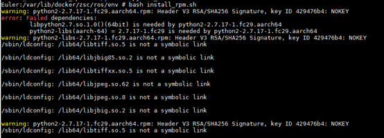
</div>

我在截图中执行的是bash install_rpm.sh，这个文件进行的操作是

1. 切换目录至hilens_ros/python_req 
2. 安装rpm软件包

你可忽略这个文件，只需要按照上面我的命令操作即可。
出现第一个报错是因为缺少动态库，而第二个rpm包会安装相关库，所以再次执行第一个rpm安装命令，此时安装成功。

## 下载ROS库

1. **[重点]** 在新的窗口中操作，去除之前环境变量的影响，以免python环境混乱

```
$ pip install -U rosdep defusedxml pyserial -i https://pypi.tuna.tsinghua.edu.cn/simple # 使用清华源

```

<div align="left">
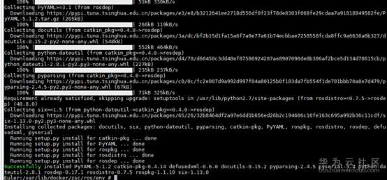
</div>
此时numpy可以正常使用

<div align="left">
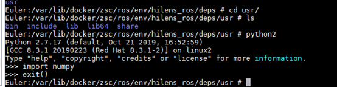
</div>

2. 将deps/usr文件夹的文件复制到系统/usr下

<div align="left">
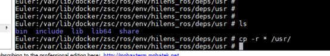
</div>
此时numpy报错：
<div align="left">
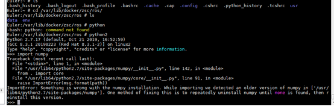
</div>
重装numpy：

```
$ rpm -U --reinstall python2-numpy-1.15.1-1.fc29.aarch64.rpm
```

<div align="left">
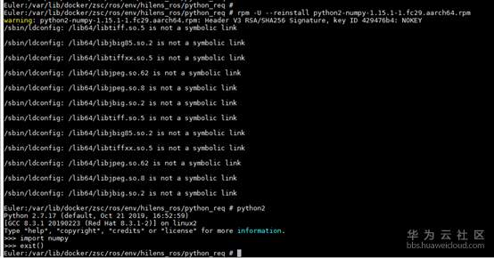
</div>
建立ros_catkin_ws软连接：

```
$ ln -s /var/lib/docker/zsc/ros/env/hilens_ros/ros_catkin_ws /
```
<div align="left">
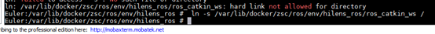
</div>
激活ROS环境：

```
$ source /ros_catkin_ws/install_isolated/setup.bash
```
<div align="left">
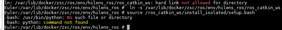
</div>
此时报错说找不到python，是因为我们安装的python的可执行文件为python2，所以我们在系统中建立软连接，将python映射到python2

```
$ ln -s /usr/bin/python2 /usr/bin/python
```
<div align="left">
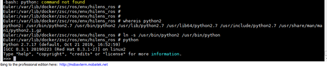
</div>
重新激活环境：

```
$ source /ros_catkin_ws/install_isolated/setup.bash
$ ldconfig /ros_catkin_ws/cb_ws/install/lib
```
<div align="left">
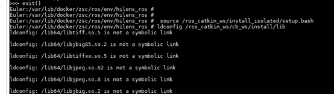
</div>
运行：

```
$ roscore
```

<div align="left">
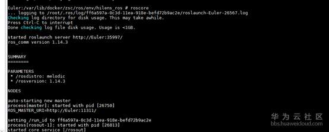
</div>
可能会报错：
<div align="left">
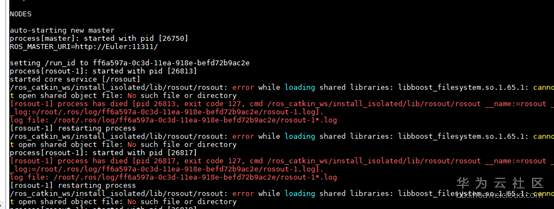
</div>
将该库所在的路径加入环境变量中下：

```
$ export LD_LIBRARY_PATH=$LD_LIBRARY_PATH:/var/lib/docker/zsc/ros/env/hilens_ros/boost_arm/lib/
```
<div align="left">
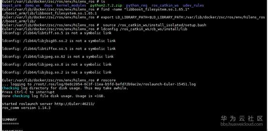
</div>
此时ROS已经能够正常运行了

## 安装驱动 

如果需要使用 Arduino 和 RPLidar，则必须安装USB的驱动。 
在/var/lib/docker/zsc/ros/env/hilens_ros/kernel_modules 目录中有两个驱动文件，分别为ch34x.ko，cp210x.ko。
使用命令安装：

```
$ insmod ch34x.ko
$ insmod cp210x.ko
```

使用此命令安装设备重新后需要重新安装才能生效，可以在设备启动时执行该安装命令或者拷贝到usb的串口目录下（此方法此处不做介绍）
使用lsmod查看安装的驱动信息：

```
$ lsmod
```

此时驱动安装成功！
复制udev_rules 文件夹中的文件至/etc/udev/rules.d

```
$ cd /var/lib/docker/zsc/ros/env/hilens_ros/udev_rules
$ cp -r * /etc/udev/rules.d/
```
重启udev 规则：

```
$ udevadm control --reload-rules && udevadm trigger
```
<div align="left">
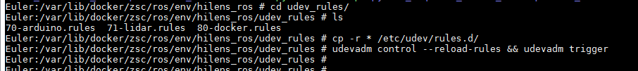
</div>
此时可以测试Arduino nano 和 RPLidar 是否可以正常使用。