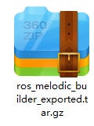
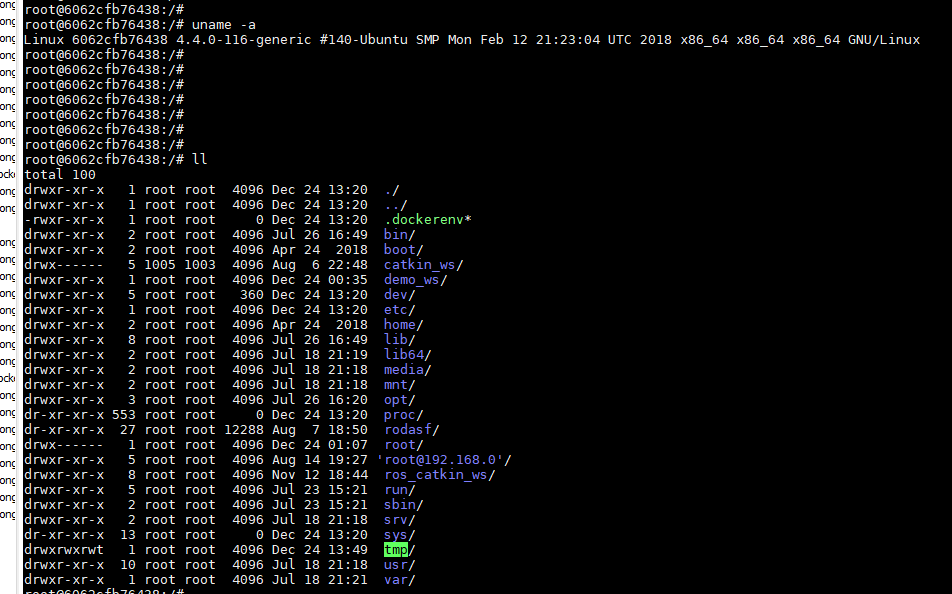
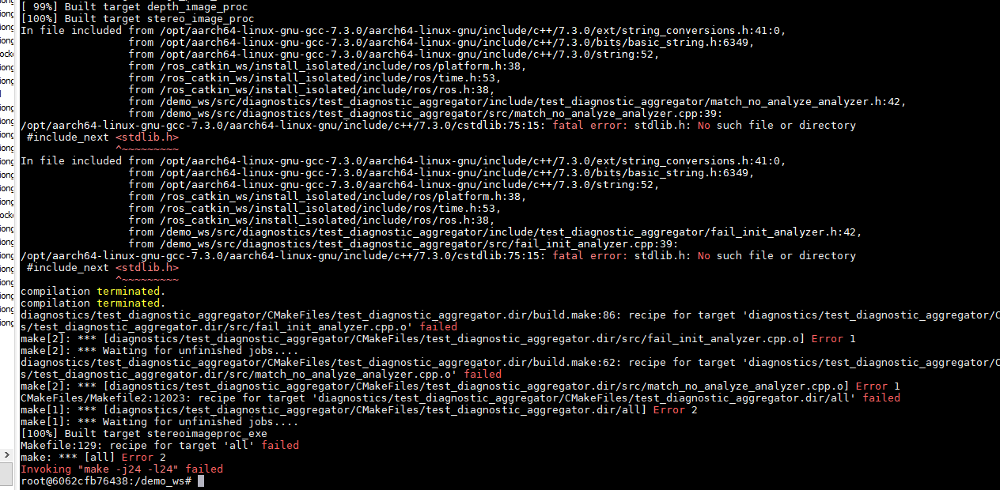
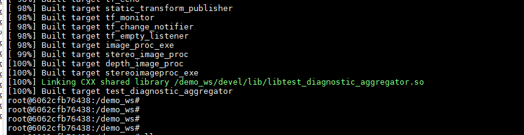

# ROS程序编译

该文档主要用于在ubuntu机子上面编译ros库，当编译成功后，将整个文件夹的库拷贝至HiLens Kit 上面进行运行

A quick note: 

1.	不能使用windows10的WSL 进行操作。
2.	在执行如下指令前，请确保ubuntu上面的docker能够正常运行

**如果ROS是安装在与它匹配的架构的机子上面，你只需要执行”catkin_init”去初始化ROS catkin workspace 以及”catkin_make”去build workpsace。在每个workspace中都需要一个”src”文件夹存放你所需要编译的ROS packages 。**

但是， 现在ROS 没有安装在这个docker 镜像中，但是我们可以用aarch64的库来编译ROS。（ROS以及安装在HiLens上面了），这种方式叫做 isolated building.

**下面已demo编译为例，讲解如何使用。Demo文件存放在/demo_ws 中，进入到镜像之后可以查看。**


## 步骤一 

<div align="left">

</div>

下载docker 镜像文件，这个tar.gz 文件需要用docker import 来加载，然后进入之后，如图所示：

<div align="left">

</div>

## 步骤二

执行如下命令，能够激活所有需要的ROS和catkin相关东西，这个叫做hybrid build . runtime libraries 是aarch64，因为你需要在hilens kit上面去运行， 而build libraries是amd64，因为你是在这个镜像里面build。

```
$  source /ros_catkin_ws/devel_isolated/setup.bash 
```

## 步骤三 

编译demo文件 ： 文件目录/demo_ws . 
如果你进入到、demo_ws/src中，你可以看到我们已经提供了很多ROS相关的库(HiLens ROS driver，  RPLIdar driver, Kineck driver, mBot driver 等等)

执行如下命令，编译demo。 

```
$ cd /demo_ws
```

Build 这个workspace，你将用到catkin_make， 但是必须告诉它用aarch64 去编译。所以需要执行命令： 

```
$ catkin_make -DCMAKE_TOOLCHAIN_FILE=/ros_catkin_ws/rostoolchain.cmake
```

当demo 开始编译时，你将会遇到如下报错： 

<div align="left">

</div>

出现如图所示的编译错误，是因为aarch64 和amd64 冲突. 所以执行指令： 

```
$ sed -i 's/isystem/I/g' ./build/diagnostics/test_diagnostic_aggregator/CMakeFiles/test_diagnostic_aggregator.dir/flags.make
```

最后 再次执行命令： 

```
$ catkin_make -DCMAKE_TOOLCHAIN_FILE=/ros_catkin_ws/rostoolchain.cmake 
```

你将看到如下所示内容，说明ros程序编译成功

<div align="left">

</div>

## 步骤四

建议你将自己的packages 放入到demo_ws中，因为一些基础的ROS packages 已经build好了。